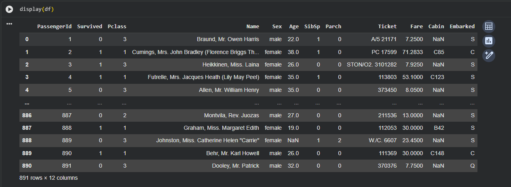
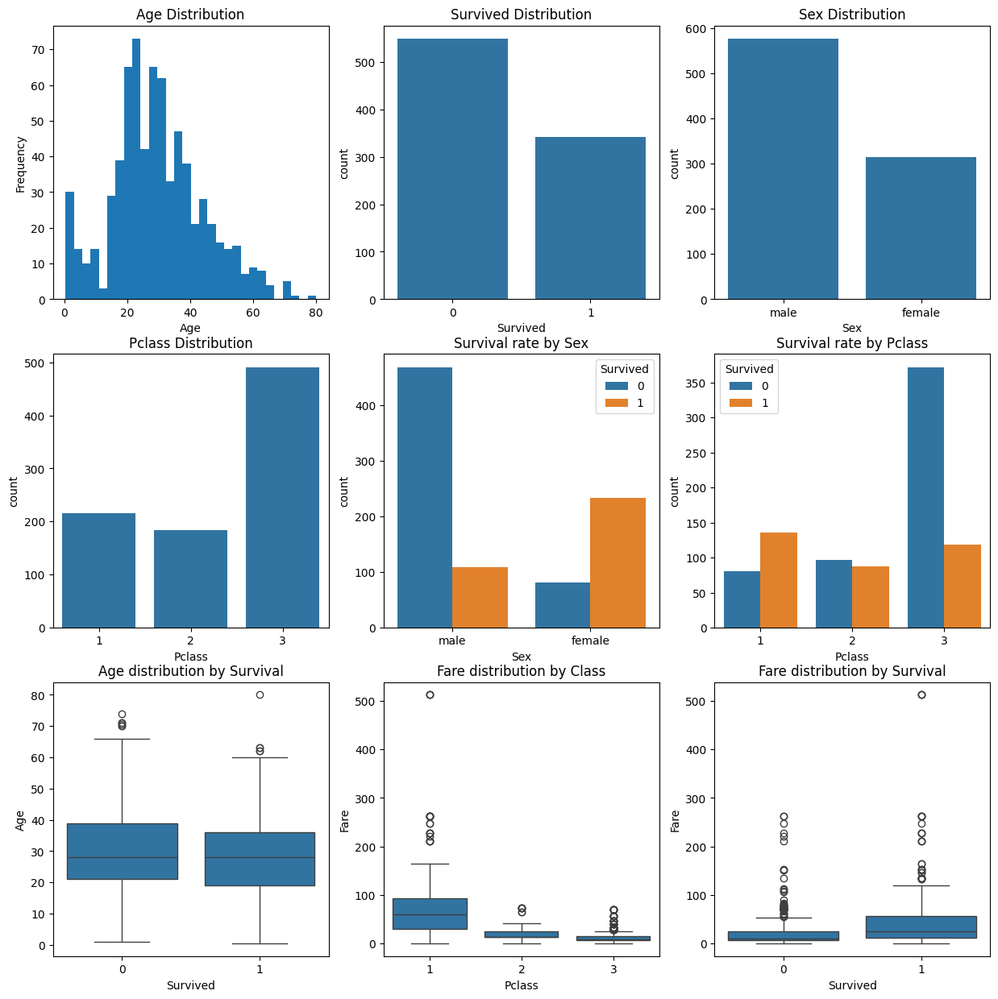
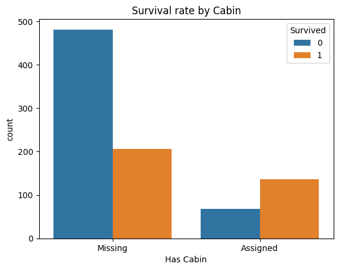
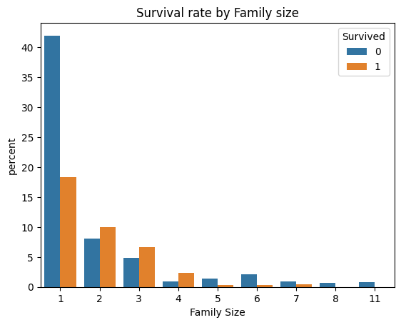

# 📰Titanic Dataset Deep Dive [EDA]
EDA project on the Titanic dataset. Creating features, visualising and analyzing relationships.

  
*Initial Dataset Preview*

---

## Table of Contents
- [Author](#author)
- [Setup](#setup)
- [Key Findings](#key-findings)
  - [Detailed Survival Statistics](#detailed-survival-statistics)
  - [Quick Results Overview](#quick-results-overview)
- [Plots](#plots)
- [Project Showcase](#project-showcase)
- [Skills Demonstrated](#skills-demonstrated)
- [Project Motivation](#project-motivation)

---

## 👤 Author
**Umut Bekdemir**
- GitHub: [@DoubleCyclone](https://github.com/DoubleCyclone)
- LinkedIn: [Umut Bekdemir](https://www.linkedin.com/in/umut-bekdemir-803a2825a)
- Email: umut.bekdemir29@gmail.com

---

## ⚙️ Setup
- Download the [dataset](https://www.kaggle.com/datasets/yasserh/titanic-dataset).
- On Google Drive, upload the dataset to the "/content/drive/My Drive/Colab_Materials/Titanic_Dataset_Deep_Dive" directory (or change how the dataset .csv is loaded in the notebook)
- See the [full analysis](/notebooks/Titanic_Dataset_Deep_Dive.ipynb) for details.

---

## 🔎 Key Findings
- Females, passangers who had an assigned cabin, passangers who got better class tickets and people with middle sized families aboard the Titanic tend to have had a higher survival rate.
- Even if a huge portion of the data in a column is missing, it can still be utilized by comparing missing to non-missing data.
- Creating more meaningful features from existing features is very useful for plotting and observing relationships between featurues.
- Using different types of plots (and libraries for them) is essential to visualise relationships between different combinations of types of data.

### ⭐ Detailed Survival Statistics
- **Overall Survival Rate**: 38.4%
- **By Gender**:
  - Female: 74.2% survived
  - Male: 18.9% survived
- **By Class**:
  - 1st Class: 62.9% survived
  - 2nd Class: 47.3% survived
  - 3rd Class: 24.2% survived

### 📈 Quick Results Overview

| Factor | Impact on Survival |
|--------|-------------------|
| Gender | ⭐⭐⭐⭐⭐ (Strongest) |
| Class | ⭐⭐⭐⭐ (Very Strong) |
| Family Size | ⭐⭐ (Moderate) |
| Fare | ⭐⭐ (Moderate) |

### ✏️ Plots

  
*Univariate/Bivariate Distributions*

  
*Survival Rate by Cabin Information*

  
*Survival Rate by Family Size*

---

## 🎬 Project Showcase

This project demonstrates my ability to perform:

- **Data Cleaning**: Handled missing values systematically
- **Statistical Analysis**: Identified key survival factors
- **Data Visualization**: Created clear, informative plots
- **Feature Engineering**: Developed new meaningful variables
- **Python Programming**: Clean, well-documented code
- **Communication**: Translated findings into insights

---

## 🎓 Skills Demonstrated

This project showcases:

**Technical Skills:**
- Python programming
- Pandas data manipulation
- Data visualization (Matplotlib, Seaborn)
- Statistical analysis
- Missing data handling
- Feature engineering

**Analytical Skills:**
- Pattern recognition
- Insight generation
- Story-telling with data

**Professional Skills:**
- Documentation
- Code organization
- Version control (Git/GitHub)
- Reproducible research

---

## 💭 Project Motivation

I chose the Titanic dataset because:

1. **Data Science Foundation**: A classic dataset perfect for demonstrating EDA skills
2. **Real-World Complexity**: Contains missing data, categorical and numerical features

---

## 🔮 Future Enhancements
   - [ ] Analyze and plot more relationships
